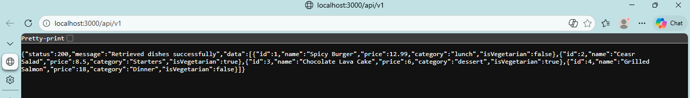
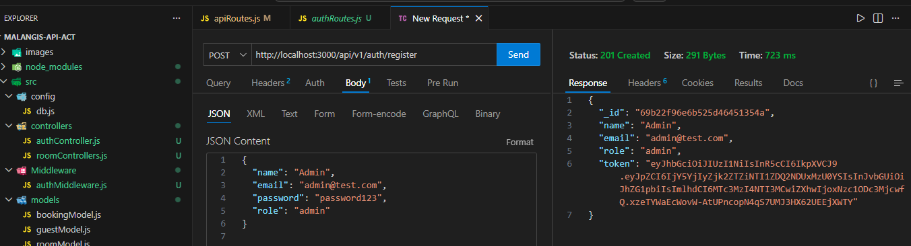
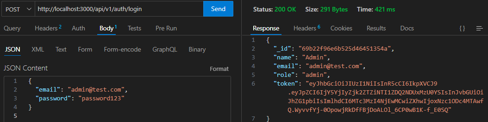
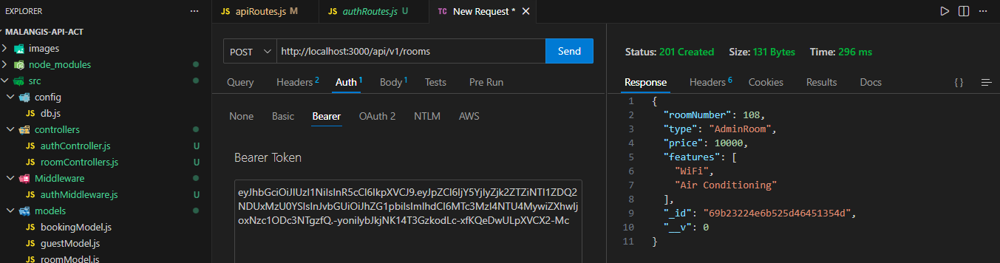

**##RESTful API Activity - Jojo J. Malangis**
**##Best Practices Implementation**

*1. Environment Variables:*

**Why did we put 'BASE_URI in '.env' instead of hardcoding it?**

Answer: We put BASE_URI in the .env file instead of hardcoding it to keep sensitive or changing information like URLs safe and separate from our code.

*2. Resource Modeling:*

**Why did we use plural nouns (e.g., '/dishes') for our routes?**

Answer: We use plural nouns like '/dishes' for routes because it follows the standard REST API rule where the endpoint shows a collection of items. Using plural makes it clear that '/dishes' means many dishes while '/dishes/1' means one specific dish, so everyone understands the structure faster.

*3. Status Codes:*

**When do we use '201 Created' vs '200 OK'?**
**Why is it important to return '404' instead of just an empty array or generic error?**

Answer: The status code '201 Created' gets used when we successfully create a new resource through the POST method which adds a new dish while the status code 200 OK gets used to show successful reading and updating operations which do not create any new content. 
The system should return 404 instead of empty arrays or generic errors because 404 provides clear information to users and applications that the requested item does not exist in the system.
    
*4. Testing:*

**Why did I choose to Embed the maintenance Log?**

Answer: Maintenance logs are inherently room specific every entry relates exclusively to one particular room/unit in the property. They are almost always viewed, updated or referenced in direct context with that rooms overall details.

**Why did I choose to Reference the room and guest in Booking?**

Answer:Rooms and guests are independent entities that exist independently of bookings and can link to multiple bookings over time, so referencing them via ID avoids duplicating their core details across records. This ensures perfect data consistency, eliminates update errors and keeps bookings lightweight and focused on booking-specific info only.

*Part 5: Testing in Postman*

**1. Register**

**2. Login**

**3. Try to POST a new Room.**

**1. Authentication vs Authorization:**
*What is the difference between Authentication and Authorization in our code?*

o Answer: Authentication verifies a users identity by checking their email and password before issuing a JWT. Authorization, on the other hand determines what actions that authenticated user is allowed to perform based on their role.

**2. Security (bcrypt):**
*Why did we use bcryptjs instead of saving passwords as plain text in MongoDB?*

o Answer:Storing plain text passwords would expose users to immediate risk if the database were compromised. Using bcryptjs ensures passwords are hashed and salted making them unreadable and far more secure.

**3. JWT Structure:**
*What does the protect middleware do when it receives a JWT from the client?*

o Answer: The protect middleware validates the JWT, decodes its payload and attaches the corresponding user to the request. If the token is missing or invalid it blocks access by returning a 401 Unauthorized response.